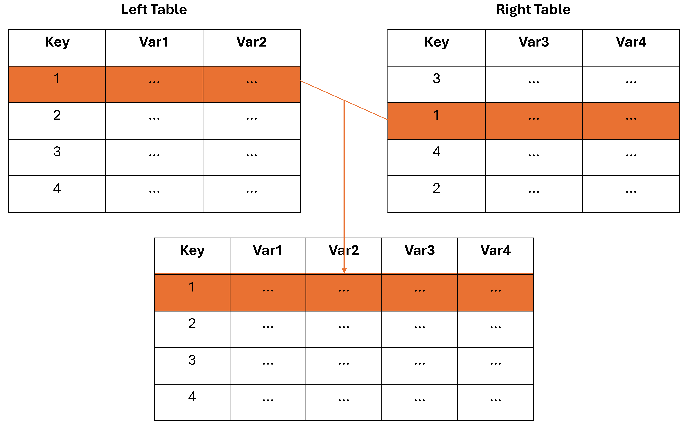

## Assignment 4 Overview

- You will examine population changes in Montreal, QC using Canadian Census data.
- You will learn:
  - How to import Excel files into ArcGIS Pro.
  - How to join tables (simple one-to-one join) in ArcGIS Pro.
  - How to create pivot tables in ArcGIS Pro.
  - How to create side-by-side bar charts in ArcGIS Pro.

## Submission Details

- This is a <u>Connect Assignment</u>.
- You will submit everything on Connect.
- The deadline is 2:00 PM on **November 12**.
- Direct all extension requests to the professor.

## Table Join

- Simple one-to-one join:
  - We have two (attribute) tables with the same number of rows.
    - These can be attribute tables from a feature layer or standalone (non-spatial) tables.
  - Both tables have a common key column containing IDs for each record.
  - Each unique ID in the left table corresponds one-to-one with a record in the right table.

## Simple one-to-one join

:::{style="text-align: center;"}
{height=550px}
:::
