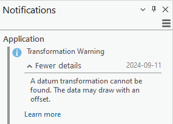
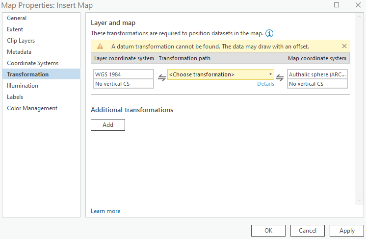

## What does transformation warning mean?

:::: {.columns}

::: {.column width="30%"}
```{=html}
<p>


<p>
```
:::

::: {.column width="70%"}

- You reopen your assignment 1 project after you finished the insert map portion.

- The _projection-on-the-fly_ feature of the ArcGIS Pro is not working fully.

- Different layers being misaligned in the maps.

- These offsets usually range between several centimeters and several meters.

:::

::::

## What is causing this?

:::: {.columns}

::: {.column width="50%"}

```{=html}
<p>

<p>
```

:::

::: {.column width="50%"}

- The projection used by the insert map is different from the World Imagery (Firefly).

- The Customized World from Space $\neq$ WGS 1984 Web Mercator (auxiliary sphere)

- Meanwhile, no existing transformation path is known to ArcGIS Pro.

:::

::::

## What to do?

:::: {.columns}

::: {.column width="50%"}

- Ignore the warning message.
  - Preferred way for now.
  - We are only making maps.
  - Study area is large in size.
  - Not care that much about location accuracy.
  - Not a big deal for being off a few meters.

:::

::: {.column width="50%"}

- Some other solutions to consider:
  - Keep all the layers in the same map using the same projection.
  - Find or create appropriate transformation method.

:::

::::

## Reference

- [https://www.esri.com/arcgis-blog/products/arcgis-pro/mapping/transformation-warning/](https://www.esri.com/arcgis-blog/products/arcgis-pro/mapping/transformation-warning/)
